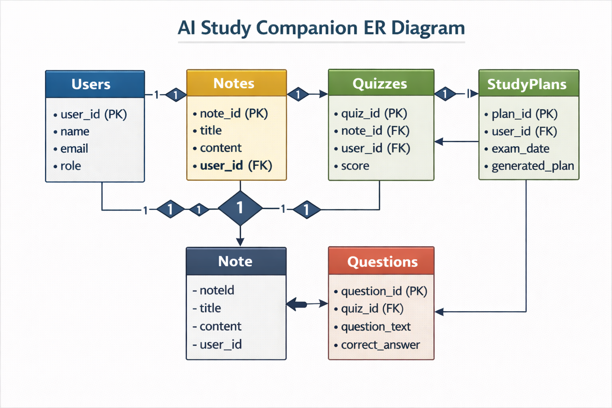
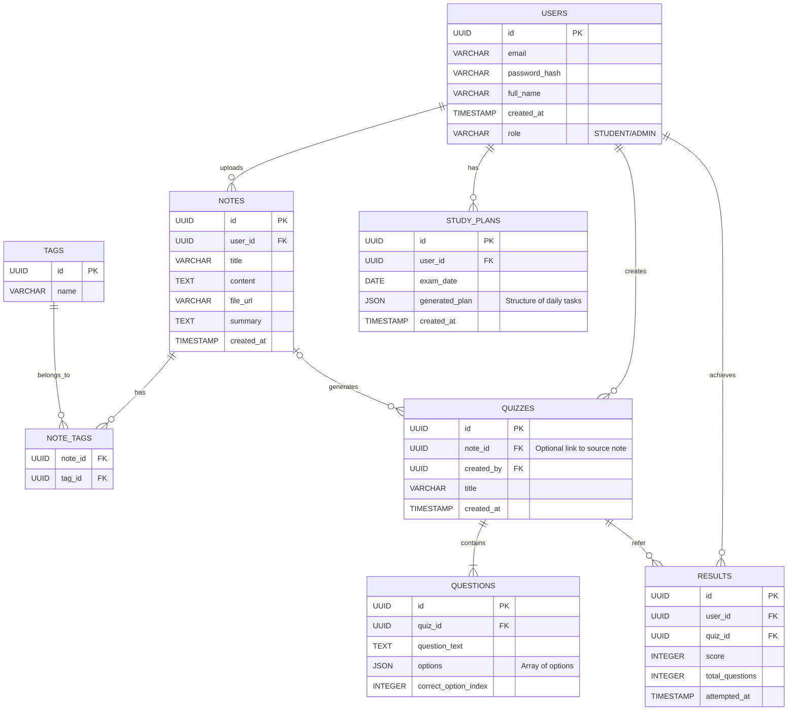

# AI Study Companion - Entity Relationship Diagram

The **ER Diagram** visualizes the database schema, showing the tables and how they relate to each other. This structure ensures data integrity and efficient retrieval (e.g., retrieving all quizzes for a specific note).

### 🗄️ Database Schemas
- **USERS**: Stores account information and roles.
- **NOTES**: Contains metadata and content of uploaded files.
- **QUIZZES & QUESTIONS**: Stores generated tests and their associated questions/answers.
- **RESULTS**: Tracks student scores and progress.
- **STUDY_PLANS**: Manages personalized schedules and deadlines.

