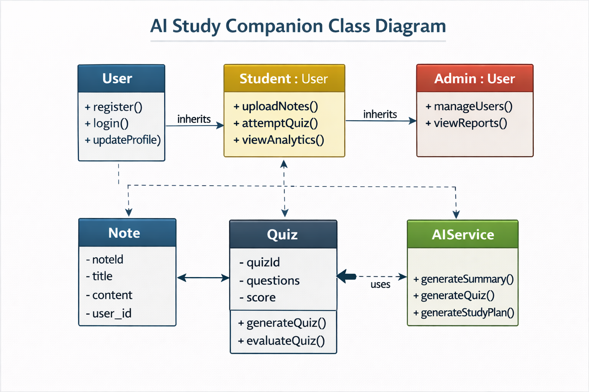
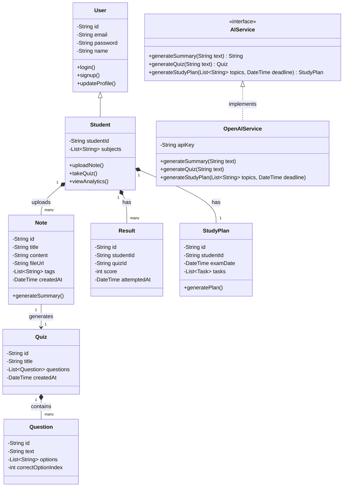

# AI Study Companion - Class Diagram

```mermaid
classDiagram
    class User {
        -String id
        -String email
        -String password
        -String name
        +login()
        +signup()
        +updateProfile()
    }

    class Student {
        -String studentId
        -List~String~ subjects
        +uploadNote()
        +takeQuiz()
        +viewAnalytics()
    }

    class Note {
        -String id
        -String title
        -String content
        -String fileUrl
        -List~String~ tags
        -DateTime createdAt
        +generateSummary()
    }

    class Quiz {
        -String id
        -String title
        -List~Question~ questions
        -DateTime createdAt
    }

    class Question {
        -String id
        -String text
        -List~String~ options
        -int correctOptionIndex
    }

    class Result {
        -String id
        -String studentId
        -String quizId
        -int score
        -DateTime attemptedAt
    }

    class StudyPlan {
        -String id
        -String studentId
        -DateTime examDate
        -List~Task~ tasks
        +generatePlan()
    }

    class AIService {
        <<interface>>
        +generateSummary(String text) String
        +generateQuiz(String text) Quiz
        +generateStudyPlan(List~String~ topics, DateTime deadline) StudyPlan
    }

    class OpenAIService {
        -String apiKey
        +generateSummary(String text)
        +generateQuiz(String text)
        +generateStudyPlan(List~String~ topics, DateTime deadline)
    }

    User <|-- Student
    Student "1" *-- "many" Note : uploads
    Student "1" *-- "many" Result : has
    Student "1" *-- "1" StudyPlan : has
    Note "1" --> "1" Quiz : generates
    Quiz "1" *-- "many" Question : contains
    AIService <|.. OpenAIService : implements
```
