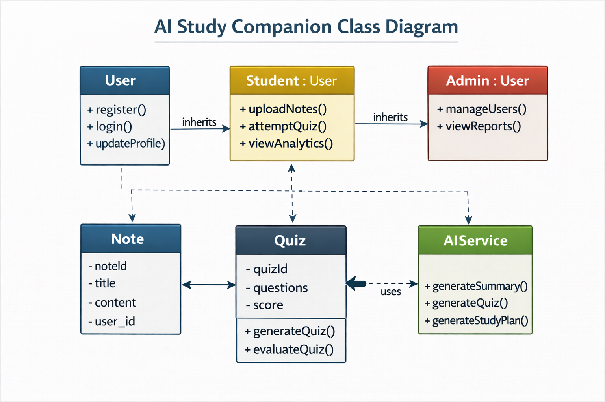
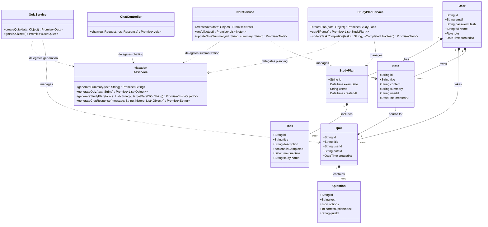

# AI Study Companion - Class Diagram

The **Class Diagram** represents the static structure of the system, defining the objects, their attributes, methods, and relationships. It serves as a blueprint for the backend implementation and demonstrates strict adherence to Object-Oriented Programming (OOP) principles.

### 🏗️ Core Architecture & OOP Principles
- **Encapsulation**: Services (`NoteService`, `QuizService`, `StudyPlanService`) encapsulate database logic and business rules.
- **Single Responsibility Principle**: `ChatController` handles chat interactions, while `AIService` acts as a facade for Groq LLM integration.
- **Data Models**: `User`, `Note`, `Quiz`, `Question`, and `StudyPlan` represent Prisma ORM models with relational mapping.

