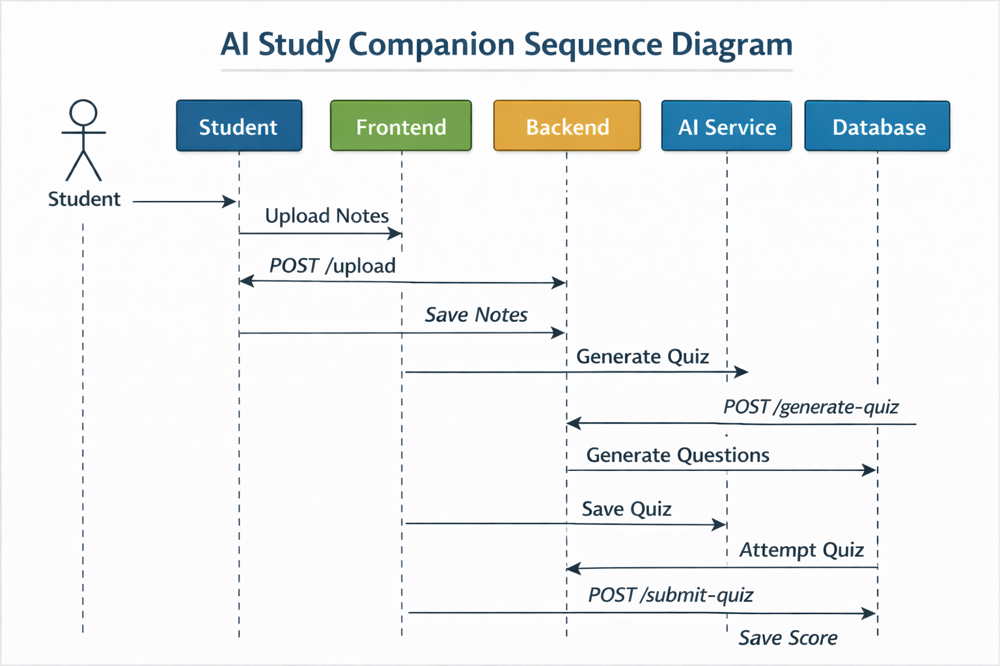
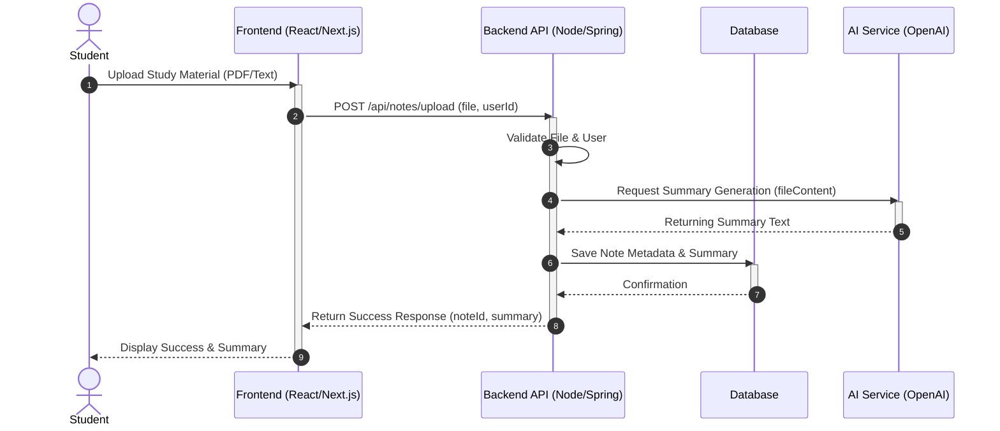
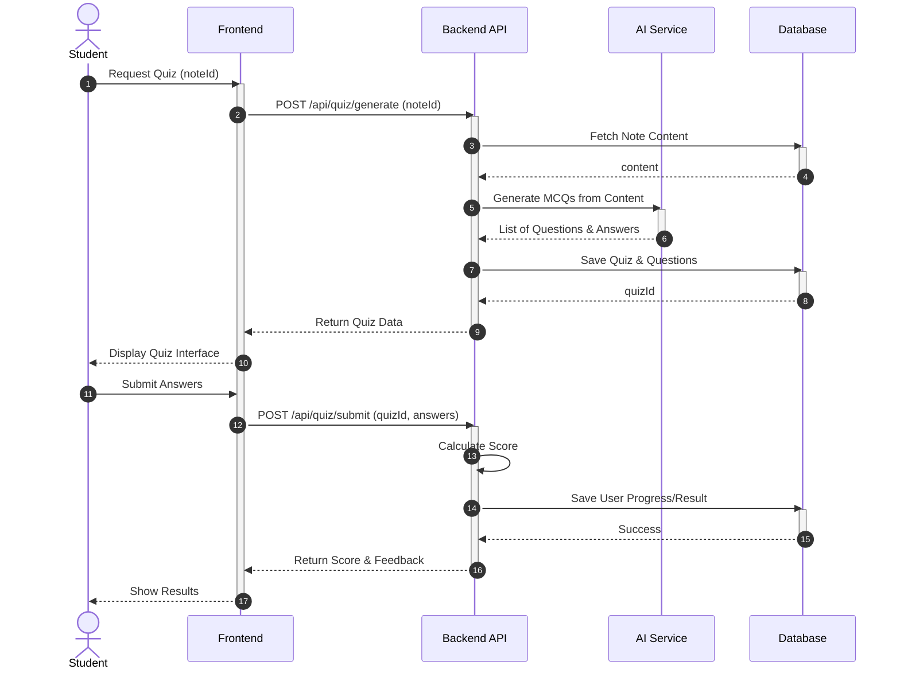

# AI Study Companion - Sequence Diagram

## Feature: Upload Note & Generate Summary

```mermaid
sequenceDiagram
    autonumber
    actor S as Student
    participant FE as Frontend (React/Next.js)
    participant API as Backend API (Node/Spring)
    participant DB as Database
    participant AI as AI Service (OpenAI)

    S->>FE: Upload Study Material (PDF/Text)
    activate FE
    FE->>API: POST /api/notes/upload (file, userId)
    activate API
    
    API->>API: Validate File & User
    API->>AI: Request Summary Generation (fileContent)
    activate AI
    AI-->>API: Returning Summary Text
    deactivate AI

    API->>DB: Save Note Metadata & Summary
    activate DB
    DB-->>API: Confirmation
    deactivate DB

    API-->>FE: Return Success Response (noteId, summary)
    deactivate API
    
    FE-->>S: Display Success & Summary
    deactivate FE
```

## Feature: Generate & Take Quiz

```mermaid
sequenceDiagram
    autonumber
    actor S as Student
    participant FE as Frontend
    participant API as Backend API
    participant AI as AI Service
    participant DB as Database

    S->>FE: Request Quiz (noteId)
    activate FE
    FE->>API: POST /api/quiz/generate (noteId)
    activate API

    API->>DB: Fetch Note Content
    activate DB
    DB-->>API: content
    deactivate DB

    API->>AI: Generate MCQs from Content
    activate AI
    AI-->>API: List of Questions & Answers
    deactivate AI

    API->>DB: Save Quiz & Questions
    activate DB
    DB-->>API: quizId
    deactivate DB

    API-->>FE: Return Quiz Data
    deactivate API
    FE-->>S: Display Quiz Interface

    S->>FE: Submit Answers
    FE->>API: POST /api/quiz/submit (quizId, answers)
    activate API
    
    API->>API: Calculate Score
    API->>DB: Save User Progress/Result
    activate DB
    DB-->>API: Success
    deactivate DB

    API-->>FE: Return Score & Feedback
    deactivate API
    FE-->>S: Show Results
    deactivate FE
```
