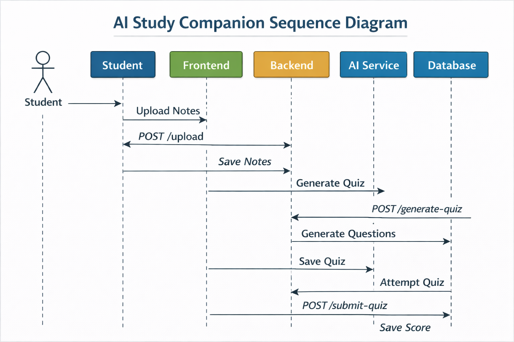
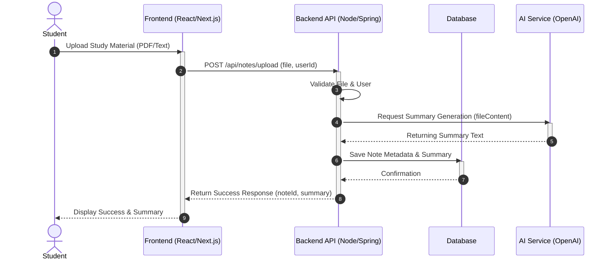
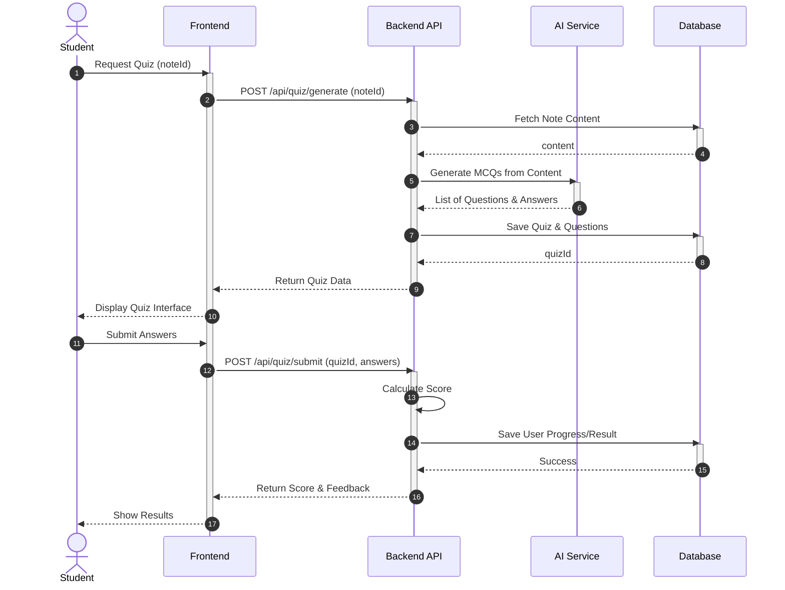
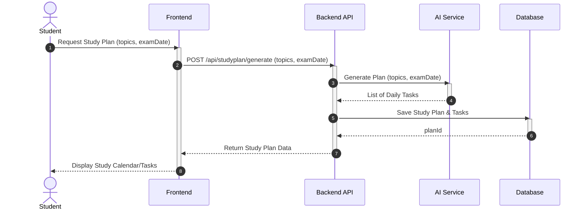

# AI Study Companion - Sequence Diagram

The **Sequence Diagram** details the step-by-step flow of operations for key features, showing how the Frontend, Backend, Database, and AI Service interact over time.

### 🔄 Key Workflows
1.  **Upload & Summary**: How a student uploads a note and receives an AI-generated summary.
2.  **Quiz Generation & Attempt**: The process of creating a quiz from notes, taking it, and submitting answers for scoring.
3.  **Generate Smart Study Plan**: How a student requests a study plan and AI generates daily tasks based on topics and deadlines.

## Feature: Upload Note & Generate Summary

## Feature: Generate & Take Quiz

## Feature: Generate Smart Study Plan

