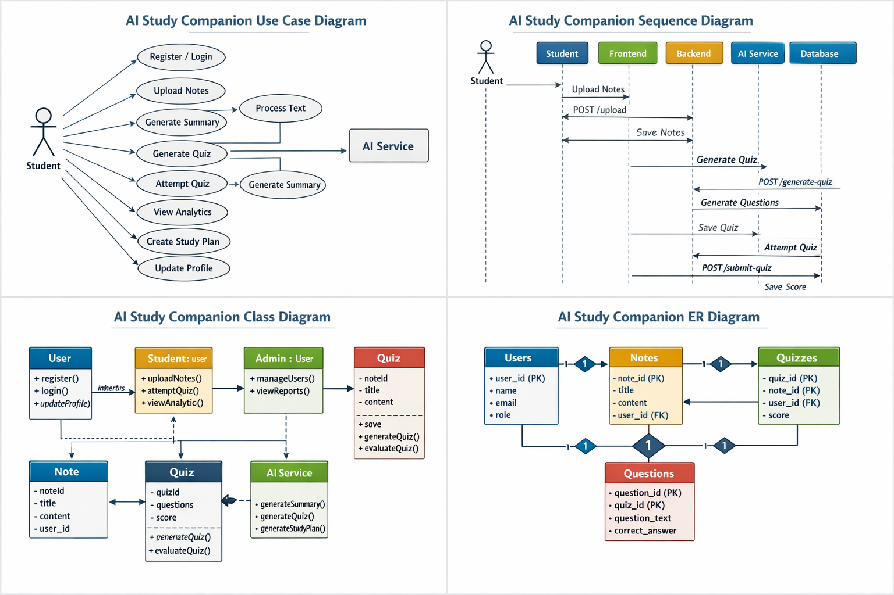

# AI Study Companion - Use Case Diagram

The **Use Case Diagram** illustrates the interactions between the **Student** and the **AI Study Companion System**. It highlights the core functionalities available to the user and the backend AI services that support them.

### 🎭 Actors
- **Student**: The primary user who interacts with the system to study, take quizzes, and track progress.
- **AI Service**: An external or internal component responsible for generating intelligence-based content (summaries, quizzes, plans).

### 🔑 Key Use Cases
- **User Actions**: Sign up/login, manage profile, upload materials, view analytics.
- **AI Interactions**: Generate summaries, create quizzes, and formulate study plans.




```mermaid
useCaseDiagram
    actor Student as "Student"
    actor AI as "AI Service"

    package "AI Study Companion System" {
        usecase "Sign Up / Login" as UC1
        usecase "Manage Profile" as UC2
        usecase "Upload Study Material (PDF/Text)" as UC3
        usecase "View AI Summaries" as UC4
        usecase "Organize Notes by Tags" as UC5
        usecase "Generate AI Quiz" as UC6
        usecase "Take Quiz & View Score" as UC7
        usecase "View Performance Analytics" as UC8
        usecase "Generate Smart Study Plan" as UC9
    }

    Student --> UC1
    Student --> UC2
    Student --> UC3
    Student --> UC4
    Student --> UC5
    Student --> UC6
    Student --> UC7
    Student --> UC8
    Student --> UC9

    UC3 ..> AI : Uses
    UC6 ..> AI : Uses
    UC9 ..> AI : Uses
```
